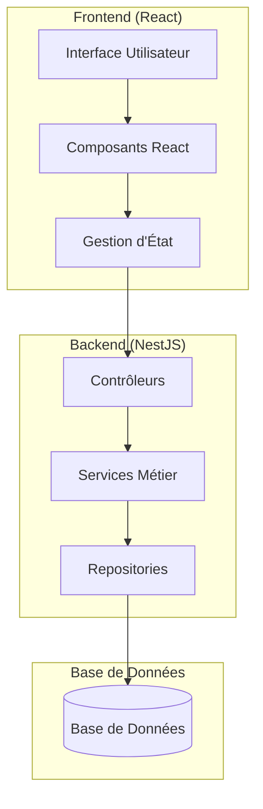

# Document de Conception - Système de Gestion des Courses

## Vue d'Ensemble

Le système de gestion des courses est une application web full-stack utilisant NestJS pour le backend et React pour le frontend. L'architecture suit le pattern MVC avec une API REST pour la communication entre les couches. Le système permet de gérer les achats, d'analyser les habitudes de consommation et de suivre les dépenses.

## Architecture

### Architecture Générale



### Architecture Backend (NestJS)

- **Contrôleurs**: Gestion des endpoints REST API
- **Services**: Logique métier et règles de validation
- **Repositories**: Accès aux données et persistance
- **DTOs**: Objets de transfert de données pour la validation
- **Entities**: Modèles de données TypeORM

### Architecture Frontend (React)

- **Composants**: Interface utilisateur modulaire
- **Hooks personnalisés**: Gestion de l'état et des appels API
- **Services**: Communication avec l'API backend
- **Types**: Définitions TypeScript partagées

## Composants et Interfaces

### Entité Achat (Purchase)

```typescript
interface Purchase {
  id: number;
  productName: string;
  price: number;
  purchaseDate: Date;
  createdAt: Date;
  updatedAt: Date;
}
```

### DTOs

```typescript
// Création d'un achat
interface CreatePurchaseDto {
  productName: string;
  price: number;
  purchaseDate: string; // ISO date string
}

// Réponse d'analyse du top produit
interface TopProductAnalysisDto {
  productName: string;
  occurrences: number;
}

// Réponse du bilan financier
interface FinancialSummaryDto {
  totalAmount: number;
  currency: string;
}
```

### API Endpoints

```typescript
// Contrôleur des achats
@Controller('purchases')
class PurchasesController {
  @Post()
  create(@Body() createPurchaseDto: CreatePurchaseDto): Promise<Purchase>
  
  @Get()
  findAll(): Promise<Purchase[]>
  
  @Get('top-product')
  getTopProduct(): Promise<TopProductAnalysisDto>
  
  @Get('financial-summary')
  getFinancialSummary(): Promise<FinancialSummaryDto>
}
```

### Services Backend

```typescript
@Injectable()
class PurchasesService {
  // Création d'un achat avec validation
  async create(createPurchaseDto: CreatePurchaseDto): Promise<Purchase>
  
  // Récupération de tous les achats triés par date
  async findAll(): Promise<Purchase[]>
  
  // Calcul du produit le plus acheté
  async getTopProduct(): Promise<TopProductAnalysisDto>
  
  // Calcul du bilan financier
  async getFinancialSummary(): Promise<FinancialSummaryDto>
}
```

### Composants React

```typescript
// Composant principal
const PurchaseManager: React.FC = () => {
  // Gestion de l'état et orchestration des composants
}

// Formulaire d'ajout d'achat
const PurchaseForm: React.FC = () => {
  // Formulaire avec validation côté client
}

// Liste des achats
const PurchaseHistory: React.FC = () => {
  // Affichage de l'historique trié
}

// Analyse du top produit
const TopProductAnalysis: React.FC = () => {
  // Affichage du produit le plus acheté
}

// Bilan financier
const FinancialSummary: React.FC = () => {
  // Affichage du montant total
}
```

## Modèles de Données

### Schéma de Base de Données

```sql
CREATE TABLE purchases (
  id SERIAL PRIMARY KEY,
  product_name VARCHAR(255) NOT NULL,
  price DECIMAL(10,2) NOT NULL CHECK (price > 0),
  purchase_date DATE NOT NULL,
  created_at TIMESTAMP DEFAULT CURRENT_TIMESTAMP,
  updated_at TIMESTAMP DEFAULT CURRENT_TIMESTAMP
);

-- Index pour optimiser les requêtes de tri par date
CREATE INDEX idx_purchases_date ON purchases(purchase_date DESC);

-- Index pour optimiser les requêtes d'analyse par produit
CREATE INDEX idx_purchases_product ON purchases(product_name);
```

### Contraintes de Données

- **product_name**: Non vide, longueur maximale 255 caractères
- **price**: Nombre décimal positif (> 0) avec 2 décimales
- **purchase_date**: Date valide, ne peut pas être dans le futur
- **Unicité**: Aucune contrainte d'unicité (plusieurs achats du même produit autorisés)

## Propriétés de Correction

*Une propriété est une caractéristique ou un comportement qui doit être vrai pour toutes les exécutions valides d'un système - essentiellement, une déclaration formelle sur ce que le système doit faire. Les propriétés servent de pont entre les spécifications lisibles par l'homme et les garanties de correction vérifiables par machine.*

### Propriétés de Correction

Basées sur l'analyse des critères d'acceptation, voici les propriétés universelles que le système doit respecter :

**Propriété 1: Création d'achat avec données valides**
*Pour tout* nom de produit non vide, prix positif et date valide, la création d'un achat doit réussir et retourner un achat avec ces données exactes
**Valide: Exigences 1.1**

**Propriété 2: Rejet des prix invalides**
*Pour tout* prix négatif ou nul, la tentative de création d'un achat doit échouer avec un message d'erreur approprié
**Valide: Exigences 1.2**

**Propriété 3: Rejet des noms de produits invalides**
*Pour toute* chaîne vide ou composée uniquement d'espaces blanches, la tentative de création d'un achat doit échouer
**Valide: Exigences 1.3**

**Propriété 4: Persistance immédiate**
*Pour tout* achat créé avec succès, il doit être immédiatement récupérable via une requête de lecture
**Valide: Exigences 1.5, 5.1**

**Propriété 5: Tri chronologique de l'historique**
*Pour toute* liste d'achats avec des dates différentes, l'historique doit les retourner triés du plus récent au plus ancien
**Valide: Exigences 2.1**

**Propriété 6: Complétude des informations d'achat**
*Pour tout* achat dans l'historique, l'affichage doit contenir le nom du produit, le prix et la date d'achat
**Valide: Exigences 2.2**

**Propriété 7: Calcul correct des occurrences**
*Pour toute* liste d'achats, le calcul des occurrences de chaque produit doit correspondre au nombre réel d'achats de ce produit
**Valide: Exigences 3.1**

**Propriété 8: Identification du produit le plus acheté**
*Pour toute* liste d'achats où un produit a strictement plus d'occurrences que les autres, ce produit doit être identifié comme le top produit
**Valide: Exigences 3.2**

**Propriété 9: Cohérence en cas d'égalité**
*Pour toute* liste d'achats où plusieurs produits ont le même nombre maximum d'occurrences, le système doit toujours retourner le même produit pour des données identiques
**Valide: Exigences 3.3**

**Propriété 10: Analyse basée sur les occurrences**
*Pour toute* liste d'achats, le produit le plus acheté doit être déterminé par le nombre d'achats et non par la valeur totale des achats
**Valide: Exigences 3.5**

**Propriété 11: Calcul correct du bilan financier**
*Pour toute* liste d'achats, le montant total doit être égal à la somme de tous les prix des achats
**Valide: Exigences 4.1**

**Propriété 12: Formatage monétaire**
*Pour tout* montant affiché, le format doit inclure la devise appropriée et respecter les conventions de formatage monétaire
**Valide: Exigences 4.4**

**Propriété 13: Gestion des erreurs de persistance**
*Pour toute* opération de sauvegarde qui échoue, le système doit maintenir les données en mémoire et informer l'utilisateur de l'échec
**Valide: Exigences 5.3**

**Propriété 14: Validation des données récupérées**
*Pour toutes* données récupérées de la base de données, le système doit valider leur intégrité avant de les utiliser
**Valide: Exigences 5.4**

**Propriété 15: Affichage des messages d'erreur**
*Pour toute* erreur survenant dans le système, un message d'erreur clair et compréhensible doit être affiché à l'utilisateur
**Valide: Exigences 6.3**

## Gestion des Erreurs

### Types d'Erreurs

1. **Erreurs de Validation**
   - Prix négatif ou nul
   - Nom de produit vide
   - Date invalide ou future
   - Format de données incorrect

2. **Erreurs de Persistance**
   - Échec de connexion à la base de données
   - Contraintes de base de données violées
   - Timeout de requête

3. **Erreurs de Calcul**
   - Division par zéro (cas improbable)
   - Overflow numérique pour de très gros montants

### Stratégies de Gestion

- **Validation côté client et serveur**: Double validation pour une meilleure expérience utilisateur
- **Messages d'erreur localisés**: Messages en français adaptés au contexte
- **Fallback gracieux**: Maintien de l'état de l'application en cas d'erreur
- **Logging**: Enregistrement des erreurs pour le débogage
- **Retry automatique**: Pour les erreurs temporaires de réseau

## Stratégie de Test

### Approche de Test Dual

Le système utilisera une approche combinant tests unitaires et tests basés sur les propriétés :

**Tests Unitaires** :
- Exemples spécifiques et cas limites
- Tests d'intégration entre composants
- Conditions d'erreur spécifiques
- Cas d'état vide (historique vide, aucun achat)

**Tests Basés sur les Propriétés** :
- Propriétés universelles sur tous les inputs
- Couverture complète des inputs via randomisation
- Validation des invariants métier
- Tests de robustesse avec données aléatoires

### Configuration des Tests Basés sur les Propriétés

- **Bibliothèque**: fast-check pour TypeScript/JavaScript
- **Itérations minimales**: 100 par test de propriété
- **Format des tags**: **Feature: gestion-courses, Property {number}: {property_text}**
- **Référence**: Chaque test de propriété doit référencer sa propriété de conception correspondante

### Équilibre des Tests Unitaires

- Les tests unitaires se concentrent sur des exemples spécifiques et des cas limites
- Éviter trop de tests unitaires - les tests basés sur les propriétés gèrent la couverture des inputs
- Les tests unitaires doivent se concentrer sur :
  - Exemples spécifiques qui démontrent le comportement correct
  - Points d'intégration entre composants
  - Cas limites et conditions d'erreur
- Les tests de propriétés doivent se concentrer sur :
  - Propriétés universelles qui s'appliquent à tous les inputs
  - Couverture complète des inputs via randomisation

### Outils et Frameworks

**Backend (NestJS)** :
- Jest pour les tests unitaires
- fast-check pour les tests basés sur les propriétés
- Supertest pour les tests d'API
- Base de données en mémoire pour les tests

**Frontend (React)** :
- React Testing Library pour les tests de composants
- Jest pour les tests unitaires
- fast-check pour les tests de logique métier
- MSW (Mock Service Worker) pour mocker les API