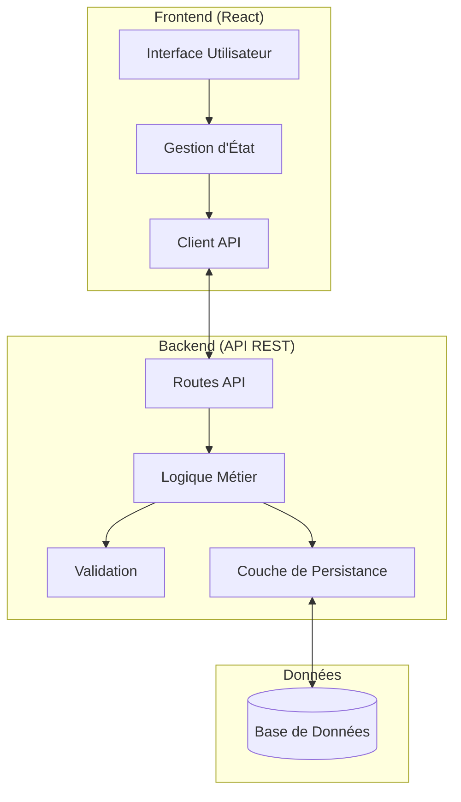

# Document de Conception

## Vue d'Ensemble

L'application "Panier Intelligent" est une application web full-stack composée d'un frontend React et d'un backend API REST. L'architecture suit le pattern client-serveur avec une séparation claire des responsabilités : le frontend gère l'interface utilisateur et les interactions, tandis que le backend gère la logique métier, la validation des données et la persistance.

## Architecture

### Architecture Générale



### Flux de Données

1. **Ajout d'achat** : Frontend → Validation locale → API POST → Validation backend → Persistance → Réponse
2. **Affichage liste** : Frontend → API GET → Récupération données → Tri → Réponse → Affichage
3. **Analyse top produit** : Frontend → API GET → Calcul occurrences → Réponse
4. **Bilan financier** : Frontend → Calcul local ou API GET → Somme des prix → Affichage

## Composants et Interfaces

### Frontend (React)

#### Composants Principaux

1. **App** - Composant racine
2. **AjoutAchat** - Formulaire d'ajout d'achat
3. **ListeCourses** - Affichage de la liste des achats
4. **TopProduit** - Analyse du produit le plus acheté
5. **BilanFinancier** - Affichage du montant total
6. **MessageErreur** - Gestion des messages d'erreur

#### Interface API Client

```typescript
interface ApiClient {
  ajouterAchat(achat: NouvelAchat): Promise<Achat>
  obtenirAchats(): Promise<Achat[]>
  obtenirTopProduit(): Promise<TopProduitResult>
}
```

### Backend (API REST)

#### Endpoints API

- `POST /api/achats` - Ajouter un nouvel achat
- `GET /api/achats` - Récupérer tous les achats
- `GET /api/achats/top-produit` - Obtenir le produit le plus acheté
- `GET /api/achats/total` - Obtenir le montant total (optionnel, peut être calculé côté frontend)

#### Services Backend

1. **AchatService** - Logique métier pour les achats
2. **ValidationService** - Validation des données
3. **StorageService** - Interface de persistance
4. **AnalyticsService** - Calculs d'analyse (top produit, totaux)

## Modèles de Données

### Modèle Achat

```typescript
interface Achat {
  id: string
  nomProduit: string
  prix: number
  dateAchat: Date
  dateCreation: Date
}

interface NouvelAchat {
  nomProduit: string
  prix: number
  dateAchat: Date
}
```

### Modèle de Réponse API

```typescript
interface ApiResponse<T> {
  success: boolean
  data?: T
  error?: string
}

interface TopProduitResult {
  nomProduit: string
  occurrences: number
}
```

### Règles de Validation

1. **nomProduit** : Non vide, longueur maximale 100 caractères
2. **prix** : Nombre positif, maximum 2 décimales
3. **dateAchat** : Date valide, ne peut pas être dans le futur
4. **id** : UUID généré automatiquement côté backend

## Correctness Properties

*Une propriété est une caractéristique ou un comportement qui doit être vrai pour toutes les exécutions valides d'un système - essentiellement, une déclaration formelle sur ce que le système doit faire. Les propriétés servent de pont entre les spécifications lisibles par l'homme et les garanties de correction vérifiables par machine.*

Avant d'écrire les propriétés de correction, je dois analyser les critères d'acceptation pour déterminer lesquels sont testables automatiquement.

### Propriétés de Correction

Basées sur l'analyse des critères d'acceptation, voici les propriétés universelles que le système doit respecter :

**Property 1: Ajout d'achat valide**
*Pour tout* achat avec un nom de produit non vide, un prix positif et une date valide, l'ajouter au système doit augmenter la taille de la liste des achats de 1 et l'achat doit être récupérable
**Validates: Requirements 1.1, 1.5**

**Property 2: Rejet des prix invalides**
*Pour tout* prix négatif ou nul, tenter d'ajouter un achat avec ce prix doit être rejeté et la liste des achats doit rester inchangée
**Validates: Requirements 1.2**

**Property 3: Rejet des noms de produits invalides**
*Pour toute* chaîne vide ou composée uniquement d'espaces blanches, tenter d'ajouter un achat avec ce nom doit être rejeté et la liste doit rester inchangée
**Validates: Requirements 1.3**

**Property 4: Nettoyage du formulaire après ajout**
*Pour tout* achat valide ajouté avec succès, les champs du formulaire doivent être vidés et prêts pour une nouvelle saisie
**Validates: Requirements 1.4**

**Property 5: Tri chronologique des achats**
*Pour toute* liste d'achats avec des dates différentes, l'affichage doit les présenter triés du plus récent au plus ancien
**Validates: Requirements 2.1**

**Property 6: Complétude des informations affichées**
*Pour tout* achat dans la liste affichée, il doit contenir le nom du produit, le prix et la date d'achat
**Validates: Requirements 2.2**

**Property 7: Réactivité de l'interface**
*Pour toute* modification de la liste des achats (ajout/suppression), l'affichage de la liste et le bilan financier doivent se mettre à jour automatiquement
**Validates: Requirements 2.4, 4.3**

**Property 8: Calcul du top produit**
*Pour toute* liste d'achats, le produit retourné comme "top produit" doit être celui avec le plus grand nombre d'occurrences
**Validates: Requirements 3.1**

**Property 9: Déterminisme en cas d'égalité**
*Pour toute* liste d'achats où plusieurs produits ont le même nombre maximum d'occurrences, le système doit toujours retourner le même produit pour la même liste
**Validates: Requirements 3.2**

**Property 10: Format de sortie du top produit**
*Pour tout* résultat de top produit, la réponse doit contenir le nom du produit et le nombre d'occurrences
**Validates: Requirements 3.4**

**Property 11: Calcul du montant total**
*Pour toute* liste d'achats, la somme affichée doit être égale à la somme arithmétique de tous les prix
**Validates: Requirements 4.1**

**Property 12: Format monétaire**
*Pour tout* montant affiché, il doit respecter le format monétaire avec exactement deux décimales
**Validates: Requirements 4.4**

**Property 13: Sérialisation JSON round-trip**
*Pour tout* objet achat valide, le sérialiser en JSON puis le désérialiser doit produire un objet équivalent
**Validates: Requirements 5.4**

**Property 14: Gestion des erreurs de communication**
*Pour toute* erreur de communication avec le backend, le système doit informer l'utilisateur et maintenir un état cohérent
**Validates: Requirements 5.3, 6.2**

**Property 15: Messages d'erreur de validation**
*Pour toute* erreur de validation, le système doit afficher un message d'erreur spécifique et clair
**Validates: Requirements 6.1**

**Property 16: Cohérence d'état en cas d'erreur**
*Pour toute* opération qui échoue, le système doit préserver l'état précédent et rejeter les données invalides
**Validates: Requirements 6.3, 6.4**

## Gestion des Erreurs

### Types d'Erreurs

1. **Erreurs de Validation**
   - Prix négatif ou nul
   - Nom de produit vide
   - Date invalide ou future
   - Format de données incorrect

2. **Erreurs de Communication**
   - Perte de connexion réseau
   - Timeout de requête
   - Erreur serveur (5xx)
   - Erreur client (4xx)

3. **Erreurs de Données**
   - Données corrompues du backend
   - Format JSON invalide
   - Champs manquants

### Stratégies de Gestion

1. **Validation Côté Frontend** : Validation immédiate des saisies utilisateur
2. **Validation Côté Backend** : Double validation pour la sécurité
3. **Messages d'Erreur Contextuels** : Messages spécifiques à chaque type d'erreur
4. **Retry Logic** : Nouvelle tentative automatique pour les erreurs réseau temporaires
5. **État de Fallback** : Maintien d'un état cohérent en cas d'échec

## Stratégie de Test

### Approche de Test Dual

L'application utilisera une approche de test combinant :

**Tests Unitaires** :
- Tests d'exemples spécifiques et de cas limites
- Tests d'intégration entre composants
- Tests de conditions d'erreur
- Focus sur les cas concrets comme "liste vide" ou "égalité d'occurrences"

**Tests Basés sur les Propriétés** :
- Validation des propriétés universelles sur de nombreuses entrées générées
- Couverture exhaustive des cas d'entrée via la randomisation
- Minimum 100 itérations par test de propriété
- Chaque test de propriété doit référencer sa propriété du document de design

### Configuration des Tests de Propriétés

**Bibliothèque recommandée** :
- Frontend (React/TypeScript) : `fast-check`
- Backend (Node.js) : `fast-check` ou équivalent selon le langage choisi

**Format de Tag** :
Chaque test de propriété doit être tagué avec :
**Feature: panier-intelligent, Property {number}: {property_text}**

**Exemples de Tests** :
- Property 1 : Générer des achats valides aléatoirement et vérifier l'ajout
- Property 5 : Générer des listes d'achats avec dates aléatoires et vérifier le tri
- Property 11 : Générer des listes d'achats et vérifier que la somme calculée est correcte

### Balance des Tests

- **Tests unitaires** : Cas spécifiques, exemples concrets, intégration
- **Tests de propriétés** : Propriétés universelles, couverture large
- **Tests d'intégration** : Communication frontend-backend, flux complets
- **Tests de validation** : Gestion d'erreurs, cas limites

Les tests de propriétés gèrent la couverture extensive des entrées, tandis que les tests unitaires se concentrent sur les cas spécifiques et les points d'intégration critiques.